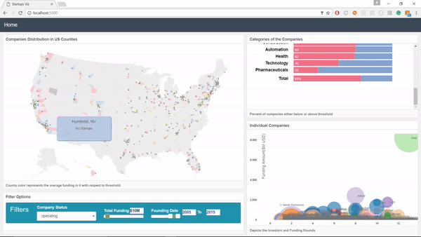
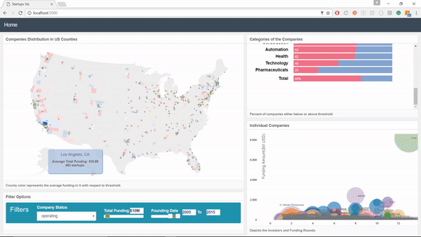
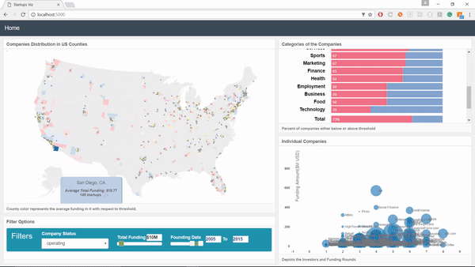
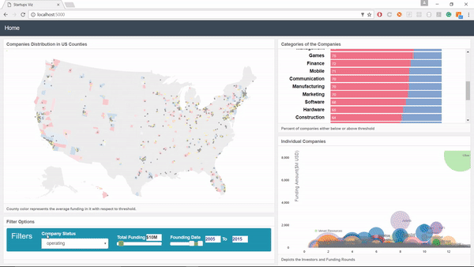

A tool to analyze charateristics of startups across United States. Analyze various factors including:
* **Location**, plays an important role in funding and growth.
* **Founding date**, depicts the strategies, technology advancements, etc.
* **Stauts**, analyze based on its status - Operating, Closed, Acquired, Not operating.
* **Category**, business category the startup operates in plays a huge role with the competetors in consideration.
* **Funding amount**, classify companies based on the funding received by setting a threshold amount.

## DataSet
The data set for this analysis has been generated from various sources like **Curnchbase and web scraping.**

## Demo
Shows startup over the last 20 years and effect of
1. Its location 
2. Founding date.
3. Operational categeory and number of opponents.
4. Funding rounds.

* Blue dots represent compnies with funding above threshold.
* Ash color dots represent companies with funding below threshold.

* Overview of the bay area

* Inspecting Los Angeles from 2005 to 2015

* Browsing varoius categories and companies

* Exploring closed and acquired companies.

## Instructions for setup
* Clone this repo.

### Setup Mongo
* Install and setup Mongo. Refer  for specific instructions. 
* Import the final_data1.csv into a collection with name **'companies'**.
* Import statesnums.csv into **'statenums'** collection.
* Import uscounty1.json into **'uscounty'** collection.

### Running the app
* Install flask with
`pip install flask`

* Run the Startup_Analysis.py to launch the app.
`python Startup_Analysis.py`

## Built With:
* Python Flask
* MongoDB
* D3.js

